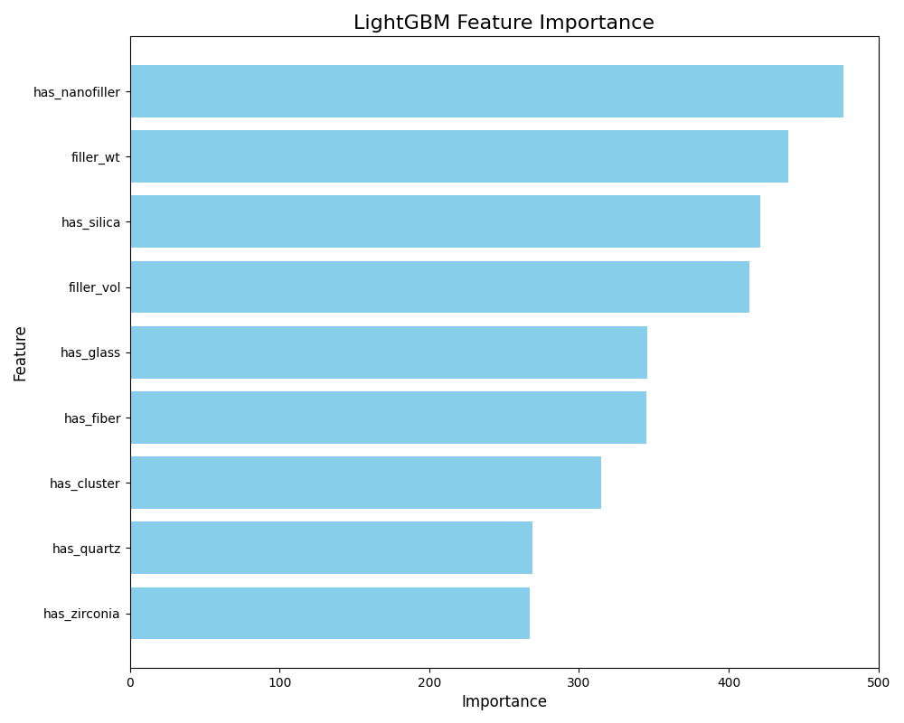
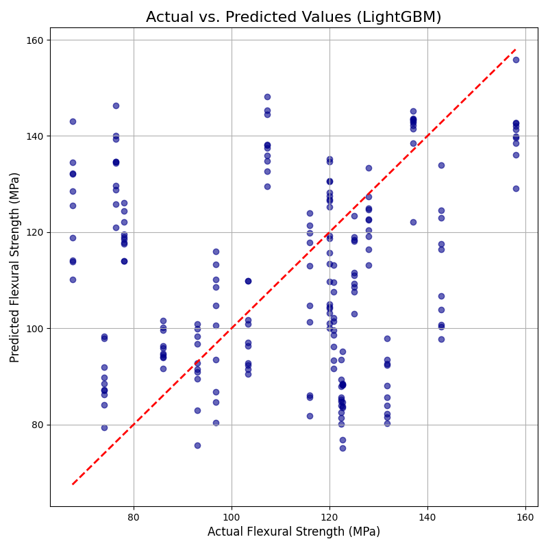

# Interpretable AI for Predicting Dental Composite Strength

This project uses machine learning to predict the flexural strength of dental composites. It demonstrates a complete end-to-end pipeline, from data preprocessing and augmentation to model training, evaluation, and in-depth interpretability analysis.

## Project Files

- `preprocess_and_augment.py`: A Python script for data cleaning, feature engineering from text descriptors, and augmenting a small dataset with synthetic samples.
- `train_and_plot.py`: A Python script that trains LightGBM and CatBoost models using GroupKFold cross-validation, computes feature importance and SHAP values, and generates a series of plots for model analysis.
- `original_dataset.xlsx`: The raw input data file.

## How to Run the Project

1.  Make sure you have all the files in the same directory.
2.  Install the necessary libraries:
    ```bash
    pip install pandas numpy scikit-learn lightgbm catboost shap joblib matplotlib
    ```
3.  Run the data preprocessing script first:
    ```bash
    python preprocess_and_augment.py
    ```
4.  Then, run the training and plotting script:
    ```bash
    python train_and_plot.py
    ```

## Key Findings

The project's key findings are summarized in the generated plots and output files, which highlight:

- The most influential features (e.g., filler content)
- The model's prediction accuracy and robustness
- The relationship between specific feature values and the model's output (see SHAP plots)

## Visualizations


_A bar chart showing the importance of each feature in the LightGBM model._


_A scatter plot showing how closely the model's predictions align with actual values._

...and so on for the other plots.
